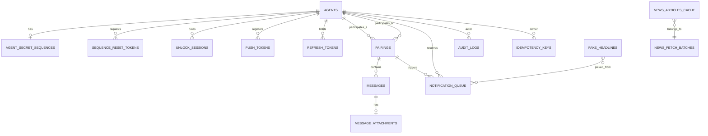

# agentNews DB 설계 v1.0

---

## 1. 문서 목적

본 문서는 agentNews v1 의 PostgreSQL 16 스키마를 정의한다. ERD + 테이블 정의 + 외래키 정책 + 인덱스 정책 + 보존 정책 + 상태값 매핑 (G4 게이트).

ddl.sql 은 본 문서와 1:1 일치해야 한다 (별도 task PLAN-003-DOC-DDL 산출물).

---

## 2. 설계 원칙

1. **PostgreSQL 16** + `pgcrypto` extension (uuid v4 `gen_random_uuid()` 용)
2. **명명**: 모든 테이블 / 컬럼 `snake_case` 복수형 테이블명 (development_conventions §3)
3. **PK**: 내부 `id bigserial PRIMARY KEY`. 외부 API 응답용은 `external_id uuid NOT NULL DEFAULT gen_random_uuid() UNIQUE` (SEC-004, IDOR 차단)
4. **감사 컬럼**: `created_at timestamptz NOT NULL DEFAULT now()`, `updated_at timestamptz NOT NULL DEFAULT now()`. agents 테이블의 row 변경은 트리거로 `updated_at` 자동 갱신
5. **soft delete**: 기본 `deleted_at timestamptz NULL`. **예외 hard delete 2건** — `message_attachments` 페어해제·90일 만료 시 MinIO 객체 hard delete 후 row 도 삭제 가능, `idempotency_keys` 24시간 후 hard delete
6. **상태 컬럼**: 모두 `varchar(32) NOT NULL` + `CHECK (status IN (...))` (PostgreSQL ENUM 미사용 — 마이그레이션 용이성)
7. **외래키**: 모두 명시적 `ON DELETE` 정책. CASCADE / SET NULL / RESTRICT 중 사유 명시
8. **상태 전이 트리거 안 함**: 전이는 application 레이어 (UseCase 트랜잭션) 책임. 다만 `audit_logs` 의 UPDATE/DELETE 차단 트리거 1개만 DB 강제
9. **암호화 컬럼**: 메시지 본문은 `ciphertext`, `iv`, `tag` 3 컬럼 분리. 시퀀스 해시는 `hash`, `salt` 2 컬럼
10. **인덱스**: 모든 외래키 + 빈번 조회 쿼리 대상 + 부분 인덱스 (`WHERE deleted_at IS NULL`) 적극 활용

---

## 3. ERD



**총 14개 테이블**:

1. `agents`
2. `agent_secret_sequences`
3. `sequence_reset_tokens`
4. `unlock_sessions`
5. `refresh_tokens`
6. `push_tokens`
7. `pairings`
8. `messages`
9. `message_attachments`
10. `notification_queue`
11. `fake_headlines`
12. `news_articles_cache`
13. `audit_logs`
14. `idempotency_keys`

---

## 4. 테이블 정의

### 4-1. agents — 에이전트 계정

| 컬럼 | 타입 | NULL | 기본값 | 제약 | 비고 |
|---|---|---|---|---|---|
| id | bigserial | N | - | PK | |
| external_id | uuid | N | gen_random_uuid() | UQ | 외부 API 응답 / 검색 키 (SEC-004) |
| email | varchar(255) | N | - | UQ (부분, deleted_at IS NULL) | 소문자 정규화 |
| password_hash | varchar(72) | N | - | - | bcrypt cost 12 (SEC-001) |
| nickname | varchar(40) | N | - | - | 페어링 검색 결과 노출용 |
| status | varchar(32) | N | 'ACTIVE' | CHECK | `ACTIVE`, `DELETED` (status_values §2) |
| created_at | timestamptz | N | now() | - | |
| updated_at | timestamptz | N | now() | - | |
| deleted_at | timestamptz | Y | NULL | - | soft delete |

**인덱스**: `UQ(external_id)`, 부분 `UQ(email) WHERE deleted_at IS NULL`, `idx_agents_status` (status).

---

### 4-2. agent_secret_sequences — 비밀 시퀀스 (1:1)

| 컬럼 | 타입 | NULL | 기본값 | 제약 | 비고 |
|---|---|---|---|---|---|
| id | bigserial | N | - | PK | |
| agent_id | bigint | N | - | FK→agents.id, UQ | 1 agent = 1 row |
| status | varchar(32) | N | 'NOT_REGISTERED' | CHECK | `NOT_REGISTERED`, `REGISTERED`, `RESET_PENDING` (status_values §3) |
| sequence_length | smallint | Y | NULL | CHECK (4..6) | 길이 4~6 (REQ-006) |
| hash | bytea | Y | NULL | - | HMAC-SHA256 결과 (32B). REGISTERED 시 NOT NULL (CHECK) |
| salt | bytea | Y | NULL | - | 16B 랜덤. hash 와 동시 NOT NULL |
| registered_at | timestamptz | Y | NULL | - | 등록/변경 시각 |
| reset_requested_at | timestamptz | Y | NULL | - | RESET_PENDING 진입 시각 |
| created_at | timestamptz | N | now() | - | agent row 생성 시 동일 트랜잭션 |
| updated_at | timestamptz | N | now() | - | |
| deleted_at | timestamptz | Y | NULL | - | soft delete (agent DELETED cascade) |

**CHECK 제약**: `(status = 'NOT_REGISTERED') OR (hash IS NOT NULL AND salt IS NOT NULL AND sequence_length IS NOT NULL)`.

**인덱스**: `UQ(agent_id) WHERE deleted_at IS NULL`, `idx_secret_sequences_status`.

**FK**: `agent_id → agents(id) ON DELETE CASCADE` (agent soft delete 만 사용. agent hard delete 는 운영 직접).

---

### 4-3. sequence_reset_tokens — 시퀀스 reset 링크 토큰

| 컬럼 | 타입 | NULL | 기본값 | 제약 | 비고 |
|---|---|---|---|---|---|
| id | bigserial | N | - | PK | |
| agent_id | bigint | N | - | FK→agents.id | |
| token_hash | bytea | N | - | UQ | HMAC-SHA256 (평문 URL token 은 메일로만 1회 발송) |
| expires_at | timestamptz | N | - | - | 발급 후 30분 (REQ-008) |
| consumed_at | timestamptz | Y | NULL | - | 사용 시각. NOT NULL = 사용됨 |
| created_at | timestamptz | N | now() | - | |
| updated_at | timestamptz | N | now() | - | |

**인덱스**: `UQ(token_hash)`, `idx_reset_tokens_agent` (agent_id), `idx_reset_tokens_expires` (expires_at) — 만료 정리 배치용.

**FK**: `agent_id → agents(id) ON DELETE CASCADE`.

**보존**: `consumed_at` 또는 `expires_at` 경과 후 24시간 hard delete.

---

### 4-4. unlock_sessions — unlock_token 발급 기록

| 컬럼 | 타입 | NULL | 기본값 | 제약 | 비고 |
|---|---|---|---|---|---|
| id | bigserial | N | - | PK | |
| agent_id | bigint | N | - | FK→agents.id | |
| token_jti | uuid | N | gen_random_uuid() | UQ | JWT 의 jti claim |
| status | varchar(32) | N | 'ACTIVE' | CHECK | `ACTIVE`, `EXPIRED`, `REVOKED` |
| issued_at | timestamptz | N | now() | - | |
| expires_at | timestamptz | N | - | - | issued_at + 30분 |
| last_seen_at | timestamptz | N | now() | - | 모바일 ping 시각. 백그라운드 5초 감지용 |
| revoked_reason | varchar(32) | Y | NULL | CHECK | `BACKGROUND`, `LOGOUT`, `APP_RESTART`, `PAIR_DISCONNECT`, `NEW_UNLOCK` |
| created_at | timestamptz | N | now() | - | |
| updated_at | timestamptz | N | now() | - | |
| deleted_at | timestamptz | Y | NULL | - | soft delete |

**인덱스**: `UQ(token_jti)`, 부분 `UQ(agent_id) WHERE status='ACTIVE'` (1 agent = 동시 1 ACTIVE — dev_conventions §7-14), `idx_unlock_expires` (expires_at) — 자연만료 배치.

**FK**: `agent_id → agents(id) ON DELETE CASCADE`.

---

### 4-5. refresh_tokens — refresh JWT 관리

| 컬럼 | 타입 | NULL | 기본값 | 제약 | 비고 |
|---|---|---|---|---|---|
| id | bigserial | N | - | PK | |
| agent_id | bigint | N | - | FK→agents.id | |
| token_jti | uuid | N | gen_random_uuid() | UQ | JWT jti |
| device_label | varchar(120) | Y | NULL | - | 운영 디버깅용 (선택) |
| issued_at | timestamptz | N | now() | - | |
| expires_at | timestamptz | N | - | - | 30일 |
| revoked_at | timestamptz | Y | NULL | - | NOT NULL = 무효화됨 (로그아웃 / 재발급) |
| created_at | timestamptz | N | now() | - | |
| updated_at | timestamptz | N | now() | - | |

**인덱스**: `UQ(token_jti)`, `idx_refresh_agent` (agent_id), `idx_refresh_expires` (expires_at).

**FK**: `agent_id → agents(id) ON DELETE CASCADE`.

**보존**: `expires_at` + 7일 후 hard delete (운영 배치).

---

### 4-6. push_tokens — FCM 디바이스 토큰

| 컬럼 | 타입 | NULL | 기본값 | 제약 | 비고 |
|---|---|---|---|---|---|
| id | bigserial | N | - | PK | |
| agent_id | bigint | N | - | FK→agents.id | |
| fcm_token | varchar(512) | N | - | UQ | FCM registration token (iOS=APNs via FCM 자동 중계, Android=FCM) |
| platform | varchar(16) | N | - | CHECK | `ios`, `android` (디바이스 식별용. 토큰은 모두 FCM 형식) |
| last_seen_at | timestamptz | N | now() | - | 토큰 갱신 시각 |
| created_at | timestamptz | N | now() | - | |
| updated_at | timestamptz | N | now() | - | |
| deleted_at | timestamptz | Y | NULL | - | soft delete (로그아웃 시) |

**인덱스**: `UQ(fcm_token) WHERE deleted_at IS NULL`, `idx_push_tokens_agent` (agent_id) WHERE deleted_at IS NULL.

**FK**: `agent_id → agents(id) ON DELETE CASCADE`.

---

### 4-7. pairings — 페어링 관계

| 컬럼 | 타입 | NULL | 기본값 | 제약 | 비고 |
|---|---|---|---|---|---|
| id | bigserial | N | - | PK | |
| external_id | uuid | N | gen_random_uuid() | UQ | 외부 API 응답 (SEC-004) |
| requester_agent_id | bigint | N | - | FK→agents.id | 요청 발신자 |
| recipient_agent_id | bigint | N | - | FK→agents.id | 요청 수신자. requester ≠ recipient (CHECK) |
| status | varchar(32) | N | 'PAIRING_REQUESTED' | CHECK | `PAIRING_REQUESTED`, `PAIRED`, `PAIRING_REJECTED`, `DISCONNECTED` |
| requested_at | timestamptz | N | now() | - | |
| accepted_at | timestamptz | Y | NULL | - | PAIRED 진입 시각 |
| ended_at | timestamptz | Y | NULL | - | PAIRING_REJECTED / DISCONNECTED 진입 시각 |
| ended_by_agent_id | bigint | Y | NULL | FK→agents.id | 종료 행위자 (해제·거부·취소) |
| created_at | timestamptz | N | now() | - | |
| updated_at | timestamptz | N | now() | - | |
| deleted_at | timestamptz | Y | NULL | - | soft delete (audit 보존) |

**CHECK**: `requester_agent_id <> recipient_agent_id`.

**인덱스**:
- `UQ(external_id)`
- 부분 `UQ(requester_agent_id) WHERE status IN ('PAIRING_REQUESTED','PAIRED') AND deleted_at IS NULL` (REQ-014, 1 active pair)
- 부분 `UQ(recipient_agent_id) WHERE status IN ('PAIRING_REQUESTED','PAIRED') AND deleted_at IS NULL` (REQ-014, 양방향)
- `idx_pairings_status_requester` (status, requester_agent_id)
- `idx_pairings_status_recipient` (status, recipient_agent_id)

**FK**: `requester_agent_id → agents(id) ON DELETE RESTRICT` / `recipient_agent_id → agents(id) ON DELETE RESTRICT` / `ended_by_agent_id → agents(id) ON DELETE SET NULL`. RESTRICT = agent hard delete 전에 페어링 정리 강제.

---

### 4-8. messages — 채팅 메시지

| 컬럼 | 타입 | NULL | 기본값 | 제약 | 비고 |
|---|---|---|---|---|---|
| id | bigserial | N | - | PK | |
| external_id | uuid | N | gen_random_uuid() | UQ | 외부 API 응답 |
| pairing_id | bigint | N | - | FK→pairings.id | |
| sender_agent_id | bigint | N | - | FK→agents.id | |
| status | varchar(32) | N | 'SENT' | CHECK | `SENT`, `DELETED` |
| ciphertext | bytea | N | - | - | AES-256-GCM 결과 (SEC-002) |
| iv | bytea | N | - | CHECK (length=12) | GCM nonce 12B |
| tag | bytea | N | - | CHECK (length=16) | GCM auth tag 16B |
| has_attachment | boolean | N | false | - | message_attachments 존재 여부 (조회 최적화) |
| sent_at | timestamptz | N | now() | - | |
| created_at | timestamptz | N | now() | - | |
| updated_at | timestamptz | N | now() | - | |
| deleted_at | timestamptz | Y | NULL | - | soft delete (90일 자동 / 페어 해제 cascade) |

**인덱스**:
- `UQ(external_id)`
- `idx_messages_pairing_sent` (pairing_id, sent_at DESC) WHERE deleted_at IS NULL
- `idx_messages_sender` (sender_agent_id, sent_at DESC)
- `idx_messages_retention` (sent_at) WHERE deleted_at IS NULL — 90일 배치 스캔

**FK**: `pairing_id → pairings(id) ON DELETE RESTRICT` / `sender_agent_id → agents(id) ON DELETE RESTRICT`. cascade 는 application 레이어에서 명시 처리 (audit + MinIO 정리 동반 필요).

---

### 4-9. message_attachments — 첨부 파일 메타

| 컬럼 | 타입 | NULL | 기본값 | 제약 | 비고 |
|---|---|---|---|---|---|
| id | bigserial | N | - | PK | |
| external_id | uuid | N | gen_random_uuid() | UQ | 외부 API |
| message_id | bigint | Y | NULL | FK→messages.id | PENDING 단계는 NULL 허용 (DESIGN-001) |
| uploader_agent_id | bigint | N | - | FK→agents.id | |
| status | varchar(32) | N | 'PENDING' | CHECK | `PENDING`, `AVAILABLE`, `DELETED` |
| storage_key | varchar(255) | N | - | UQ | MinIO 객체 키 (uuid 기반) |
| mime_type | varchar(64) | N | - | CHECK | `image/jpeg`, `image/png`, `image/webp`, `application/pdf` (4종, SEC-007) |
| file_size_bytes | bigint | N | - | CHECK (>0, ≤ 26214400 = 25MB) | |
| original_filename | varchar(255) | Y | NULL | - | 표시용 (사용자 입력 — sanitize 필요) |
| magic_byte_verified | boolean | N | false | - | AVAILABLE 진입 조건 |
| uploaded_at | timestamptz | Y | NULL | - | AVAILABLE 진입 시각 |
| created_at | timestamptz | N | now() | - | |
| updated_at | timestamptz | N | now() | - | |
| deleted_at | timestamptz | Y | NULL | - | soft delete (배치 후 row 자체 hard delete 가능) |

**CHECK 제약 (DESIGN-001 정합)**:
- `(status = 'PENDING') OR (message_id IS NOT NULL)` — AVAILABLE/DELETED 는 message 연결 필수
- `(status = 'AVAILABLE') = magic_byte_verified` — 검증 통과 시에만 AVAILABLE
- `mime_type IN ('image/jpeg','image/png','image/webp','application/pdf')`
- image MIME 이면 `file_size_bytes ≤ 10485760` (10MB) — 트리거로 강제 (또는 application 검증)

**인덱스**:
- `UQ(external_id)`, `UQ(storage_key)`
- `idx_attachments_message` (message_id) WHERE deleted_at IS NULL
- `idx_attachments_uploader` (uploader_agent_id)
- `idx_attachments_status_retention` (status, created_at) — PENDING 30분 정리 + 90일 정리

**FK**: `message_id → messages(id) ON DELETE RESTRICT` (cascade 는 application), `uploader_agent_id → agents(id) ON DELETE RESTRICT`.

---

### 4-10. notification_queue — 위장 푸시 큐

| 컬럼 | 타입 | NULL | 기본값 | 제약 | 비고 |
|---|---|---|---|---|---|
| id | bigserial | N | - | PK | |
| external_id | uuid | N | gen_random_uuid() | UQ | (운영 디버깅 / IDOR 안전) |
| recipient_agent_id | bigint | N | - | FK→agents.id | |
| trigger_kind | varchar(32) | N | - | CHECK | `MESSAGE_TEXT`, `MESSAGE_IMAGE`, `MESSAGE_FILE`, `PAIRING_REQUEST`, `PAIRING_REJECT` |
| trigger_message_id | bigint | Y | NULL | FK→messages.id | trigger_kind=MESSAGE_* 일 때 NOT NULL |
| trigger_pairing_id | bigint | Y | NULL | FK→pairings.id | trigger_kind=PAIRING_* 일 때 NOT NULL |
| fake_headline_id | bigint | N | - | FK→fake_headlines.id | 발송 시 선택된 가짜 헤드라인 |
| status | varchar(32) | N | 'QUEUED' | CHECK | `QUEUED`, `SENT`, `FAILED` |
| scheduled_at | timestamptz | N | - | - | now() + 0~60s jitter (REQ-022) |
| sent_at | timestamptz | Y | NULL | - | FCM 발송 ack 시각 |
| failed_reason | varchar(64) | Y | NULL | - | TOKEN_EXPIRED, NETWORK 등 |
| created_at | timestamptz | N | now() | - | |
| updated_at | timestamptz | N | now() | - | |

**CHECK**: `(trigger_kind LIKE 'MESSAGE\_%') = (trigger_message_id IS NOT NULL)` AND `(trigger_kind LIKE 'PAIRING\_%') = (trigger_pairing_id IS NOT NULL)`.

**인덱스**:
- `UQ(external_id)`
- `idx_notif_queued_scheduled` (status, scheduled_at) WHERE status='QUEUED' — worker 폴링용
- `idx_notif_recipient` (recipient_agent_id)

**FK**: `recipient_agent_id → agents(id) ON DELETE CASCADE`, `trigger_message_id → messages(id) ON DELETE SET NULL`, `trigger_pairing_id → pairings(id) ON DELETE SET NULL`, `fake_headline_id → fake_headlines(id) ON DELETE RESTRICT`.

**보존**: SENT/FAILED 후 30일 hard delete (운영 배치).

---

### 4-11. fake_headlines — 가짜 헤드라인 풀

| 컬럼 | 타입 | NULL | 기본값 | 제약 | 비고 |
|---|---|---|---|---|---|
| id | bigserial | N | - | PK | |
| headline | varchar(160) | N | - | UQ | 한국어 뉴스 카피 |
| category | varchar(32) | N | 'general' | CHECK | `general`, `politics`, `economy`, `tech`, `culture` |
| is_active | boolean | N | true | - | 비활성화 시 발송 제외 |
| created_at | timestamptz | N | now() | - | |
| updated_at | timestamptz | N | now() | - | |

**시드 데이터**: 50개+ 한국어 헤드라인 (REQ-021, intake G-3). seed.sql 로 별도 적재.

**인덱스**: `UQ(headline)`, `idx_fake_headlines_active` (is_active) WHERE is_active=true.

---

### 4-12. news_articles_cache — 외부 뉴스 API 캐시 (TTL 10분)

| 컬럼 | 타입 | NULL | 기본값 | 제약 | 비고 |
|---|---|---|---|---|---|
| id | bigserial | N | - | PK | |
| batch_id | uuid | N | gen_random_uuid() | - | 한 fetch 의 묶음 식별 |
| display_order | smallint | N | - | CHECK (≥1) | 노출 순서 인덱스 (1=최상단, REQ-004) |
| title | varchar(300) | N | - | - | |
| url | varchar(2048) | N | - | - | |
| thumbnail_url | varchar(2048) | Y | NULL | - | |
| summary | text | Y | NULL | - | |
| source | varchar(120) | Y | NULL | - | 발행처 |
| published_at | timestamptz | Y | NULL | - | 원본 발행 시각 |
| fetched_at | timestamptz | N | now() | - | 캐시 적재 시각. TTL 10분 (REQ-004) |
| created_at | timestamptz | N | now() | - | |

**인덱스**: `idx_news_batch_order` (batch_id, display_order), `idx_news_fetched` (fetched_at) — 만료 정리.

**보존**: `fetched_at` + 1시간 hard delete (캐시 자체는 10분 TTL, 안전 버퍼 포함). soft delete 없음 (캐시 테이블).

---

### 4-13. audit_logs — 감사 로그 (append-only)

| 컬럼 | 타입 | NULL | 기본값 | 제약 | 비고 |
|---|---|---|---|---|---|
| id | bigserial | N | - | PK | |
| occurred_at | timestamptz | N | now() | - | |
| kind | varchar(48) | N | - | CHECK | state_transition §10 의 23종 + LOGIN_SUCCESS/LOGIN_FAIL/UNLOCK_FAIL 등 |
| actor_agent_id | bigint | Y | NULL | FK→agents.id | system/external 이면 NULL |
| actor_kind | varchar(16) | N | 'agent' | CHECK | `agent`, `system`, `external` |
| target_type | varchar(32) | Y | NULL | - | `pairing`, `message`, `attachment`, `unlock_session` 등 |
| target_id | bigint | Y | NULL | - | (FK 없음 — soft reference, 다양한 테이블 가리킴) |
| target_external_id | uuid | Y | NULL | - | 외부 추적용 |
| ip_address | inet | Y | NULL | - | 요청 IP (선택) |
| user_agent | varchar(255) | Y | NULL | - | 모바일 user-agent (선택) |
| context | jsonb | Y | NULL | - | 부가 정보 (구조화) |
| created_at | timestamptz | N | now() | - | |

**append-only 트리거**: `BEFORE UPDATE OR DELETE ON audit_logs FOR EACH ROW EXECUTE FUNCTION raise_audit_immutable_error()` (SEC-010, REQ-025).

**인덱스**:
- `idx_audit_occurred` (occurred_at DESC)
- `idx_audit_actor` (actor_agent_id) WHERE actor_agent_id IS NOT NULL
- `idx_audit_kind` (kind)
- `idx_audit_target` (target_type, target_id)

**FK**: `actor_agent_id → agents(id) ON DELETE SET NULL` (agent 삭제 후에도 audit 보존).

**보존**: 1년 hard delete (NFR-003). 다만 SET NULL 처리 후 row 는 잔존.

---

### 4-14. idempotency_keys — 멱등성 캐시

| 컬럼 | 타입 | NULL | 기본값 | 제약 | 비고 |
|---|---|---|---|---|---|
| id | bigserial | N | - | PK | |
| agent_id | bigint | N | - | FK→agents.id | |
| key_value | varchar(255) | N | - | - | 클라이언트 발급 Idempotency-Key |
| request_hash | bytea | N | - | - | 요청 method+path+body SHA-256 |
| response_status | smallint | Y | NULL | - | 첫 처리 응답 status |
| response_body | jsonb | Y | NULL | - | 첫 처리 응답 본문 (24시간 캐시) |
| created_at | timestamptz | N | now() | - | |
| expires_at | timestamptz | N | - | - | now() + 24시간 |

**UNIQUE 제약**: `UQ(agent_id, key_value)` — 동일 agent + 동일 key 1회만. 동일 키 + 다른 hash = `IDEMPOTENCY_KEY_CONFLICT` 오류.

**인덱스**: `UQ(agent_id, key_value)`, `idx_idempotency_expires` (expires_at) — 정리 배치.

**FK**: `agent_id → agents(id) ON DELETE CASCADE`.

**보존**: `expires_at` 경과 후 hard delete (5분 배치).

---

## 5. 인덱스 정책 (요약)

| 패턴 | 적용 |
|---|---|
| PK 자동 인덱스 | 모든 테이블 |
| `external_id` UNIQUE | agents, pairings, messages, message_attachments, notification_queue |
| 부분 UNIQUE (`WHERE deleted_at IS NULL`) | agents.email, push_tokens.fcm_token, agent_secret_sequences.agent_id |
| 활성 페어 슬롯 partial UNIQUE | pairings (requester / recipient × status IN active) |
| 시간 범위 스캔 | messages.sent_at, attachments.created_at, audit_logs.occurred_at, news_articles_cache.fetched_at |
| FK 인덱스 | 모든 FK 컬럼에 별도 B-tree (PostgreSQL 은 자동 안 만듦) |
| 상태 필터 | 부분 인덱스 `WHERE status='QUEUED'` 등 (notification_queue worker 폴링) |

---

## 6. 외래키 정책 (요약)

| 부모 → 자식 | ON DELETE | 사유 |
|---|---|---|
| agents → agent_secret_sequences | CASCADE | 1:1, agent 삭제 시 시퀀스도 |
| agents → sequence_reset_tokens | CASCADE | 부속 데이터 |
| agents → unlock_sessions | CASCADE | 부속 |
| agents → refresh_tokens | CASCADE | 부속 |
| agents → push_tokens | CASCADE | 부속 |
| agents → pairings (requester/recipient) | RESTRICT | 페어링 정리 후 agent hard delete 가능 (soft delete 만으로는 영향 없음) |
| agents → pairings.ended_by_agent_id | SET NULL | 종료 행위자는 보존 안 됨 |
| pairings → messages | RESTRICT | 페어 해제 cascade 는 application 레이어 (audit + MinIO 동반) |
| agents → messages.sender_agent_id | RESTRICT | 동일 |
| messages → message_attachments | RESTRICT | application cascade |
| agents → message_attachments.uploader_agent_id | RESTRICT | 동일 |
| agents → notification_queue | CASCADE | 부속 큐 |
| messages → notification_queue.trigger_message_id | SET NULL | 메시지 삭제 후에도 audit 추적 |
| pairings → notification_queue.trigger_pairing_id | SET NULL | 동일 |
| fake_headlines → notification_queue.fake_headline_id | RESTRICT | 헤드라인 삭제 차단 (is_active=false 로 비활성화) |
| agents → audit_logs.actor_agent_id | SET NULL | agent 삭제 후 audit 보존 |
| agents → idempotency_keys | CASCADE | 부속 |

**기본 원칙**: agent 부속 단순 데이터 = CASCADE. 비즈니스 관계 (페어/메시지/첨부) = RESTRICT + application cascade. audit 추적은 SET NULL.

---

## 7. 데이터 보존 정책 (NFR-003 정합)

| 데이터 | 보존 | 삭제 방식 |
|---|---|---|
| agents | 무기한 (soft delete) | 운영 hard delete 시 cascade 정리 |
| agent_secret_sequences | agents 와 동기 | cascade |
| sequence_reset_tokens | 30분 (사용/만료 후 24시간) | hard delete 배치 |
| unlock_sessions | 만료 후 30일 (audit 보조) | hard delete 배치 |
| refresh_tokens | 만료 후 7일 | hard delete 배치 |
| push_tokens | 로그아웃 시 soft delete | - |
| pairings | 무기한 (soft delete, audit) | - |
| messages | 90일 (soft delete) | application 배치 (페어 해제 시 즉시) |
| message_attachments | 90일 (MinIO hard delete + row 정리) | application 배치 + MinIO 객체 hard delete |
| notification_queue | SENT/FAILED 후 30일 | hard delete 배치 |
| fake_headlines | 무기한 (관리자 수동) | - |
| news_articles_cache | 10분 TTL (+ 1시간 안전 버퍼) | hard delete 배치 (5분 주기) |
| audit_logs | 1년 | hard delete 배치 (월 1회) |
| idempotency_keys | 24시간 | hard delete 배치 (5분 주기) |

**hard delete 예외 2건 (DECISIONS 정합)**: `message_attachments` (페어해제·90일), `idempotency_keys` (24시간). 나머지는 soft delete 기본.

---

## 8. 상태값 매핑 (G4 게이트)

status_values_final.md 의 7개 상태축 21개 상태값이 모두 DB 컬럼으로 매핑되는지 검증.

| 상태축 | 컬럼 | 상태값 | 매핑 |
|---|---|---|---|
| 에이전트 상태 | `agents.status` | ACTIVE, DELETED | ✓ (§4-1) |
| 비밀 시퀀스 등록 상태 | `agent_secret_sequences.status` | NOT_REGISTERED, REGISTERED, RESET_PENDING | ✓ (§4-2) |
| Unlock 세션 상태 | `unlock_sessions.status` | ACTIVE, EXPIRED, REVOKED | ✓ (§4-4) |
| 페어링 상태 | `pairings.status` | PAIRING_REQUESTED, PAIRED, PAIRING_REJECTED, DISCONNECTED | ✓ (§4-7) |
| 메시지 상태 | `messages.status` | SENT, DELETED | ✓ (§4-8) |
| 첨부파일 상태 | `message_attachments.status` | PENDING, AVAILABLE, DELETED | ✓ (§4-9) |
| 위장 푸시 상태 | `notification_queue.status` | QUEUED, SENT, FAILED | ✓ (§4-10) |

**총 21개 상태값 모두 매핑. G4 게이트 충족.**

---

## 9. 트랜잭션 / cascade 흐름 (application 레이어 책임)

DB 의 FK CASCADE 만으로 처리 불가한 흐름은 application 의 UseCase 가 다음 순서로 처리:

### 9-1. 페어 해제 (pairings.status DISCONNECTED)

```
BEGIN;
  UPDATE pairings SET status='DISCONNECTED', ended_at=now(), ended_by_agent_id=$1 WHERE id=$2;
  UPDATE messages SET status='DELETED', deleted_at=now() WHERE pairing_id=$2 AND deleted_at IS NULL;
  UPDATE message_attachments SET status='DELETED', deleted_at=now()
    WHERE message_id IN (SELECT id FROM messages WHERE pairing_id=$2);
  UPDATE unlock_sessions SET status='REVOKED', revoked_reason='PAIR_DISCONNECT'
    WHERE agent_id IN ($requester, $recipient) AND status='ACTIVE';
  INSERT INTO audit_logs (kind, actor_agent_id, actor_kind, target_type, target_id) VALUES ('PAIRING_DISCONNECT', $1, 'agent', 'pairing', $2);
COMMIT;
-- 트랜잭션 commit 후:
ENQUEUE worker: MinIO 객체 hard delete (해당 attachments storage_key 들)
```

### 9-2. 메시지 90일 만료 (배치)

```
BEGIN;
  UPDATE messages SET status='DELETED', deleted_at=now()
    WHERE deleted_at IS NULL AND sent_at < now() - INTERVAL '90 days';
  UPDATE message_attachments SET status='DELETED', deleted_at=now()
    WHERE message_id IN (그 ids) AND deleted_at IS NULL;
COMMIT;
-- commit 후 MinIO 정리
```

### 9-3. Unlock 백그라운드 종료 (5초 ping)

```
UPDATE unlock_sessions SET status='REVOKED', revoked_reason='BACKGROUND'
  WHERE agent_id=$1 AND status='ACTIVE' AND last_seen_at < now() - INTERVAL '5 seconds';
INSERT INTO audit_logs (...) ...;
```

### 9-4. 페어링 요청 (1 active pair 제약)

`pairings.UNIQUE PARTIAL INDEX` 두 개로 race 차단. INSERT 시 unique violation 잡으면 `PAIRING_ACTIVE_SLOT_OCCUPIED` 변환.

---

## 10. 트리거 (DB 강제)

DB 트리거는 최소화 (application 레이어 우선). 다음 2개만 정의:

1. **audit_logs append-only**: `BEFORE UPDATE OR DELETE ON audit_logs FOR EACH ROW EXECUTE FUNCTION raise_audit_immutable_error()` — SEC-010
2. **updated_at 자동 갱신**: 모든 테이블에 `BEFORE UPDATE FOR EACH ROW EXECUTE FUNCTION set_updated_at()` (audit_logs / news_articles_cache / idempotency_keys 제외 — 갱신 없음)

---

## 11. 스냅샷 / 이력 정책

agentNews v1 은 **명시적 snapshot 테이블 없음**. 사유:

- 메시지는 90일 만료 후 자동 삭제 → 보존 의무 없음
- 페어링은 row 자체가 종료 상태로 잔존 (soft delete)
- audit_logs 가 모든 상태 전이를 추적
- 외부 공개 발송 같은 immutable 산출물 없음 (위장 SaaS 의 비공개 도메인)

향후 v2 에서 운영 분석용 snapshot 필요 시 추가.

---

## 전제 / 우선순위 적용

- **테이블 14개 — PLAN-001/002 의 11개보다 많음**: 사유 = idempotency_keys / sequence_reset_tokens / news_articles_cache / push_tokens / refresh_tokens 분리. brief + dev_conventions 의 보안 강화가 별도 테이블 요구
- **secret_sequence_attempts 미도입**: NFR-003 의 "rate limit 전용 — 서버 메모리 또는 Redis" 결정. DB 테이블 없음
- **LOCKED_OUT 미도입**: PLAN-003 intake G-1 우선
- **PostgreSQL ENUM 미사용**: 마이그레이션 시 ENUM 변경 비용 큼. varchar + CHECK 통일
- **MinIO hard delete cascade 는 application 레이어**: FK CASCADE 만으로 외부 객체 정리 불가
- **우선순위**: Juno 지시 > brief > intake > 매뉴얼 > skill > 메모리

---

_작성: WA-Arch (Claude Opus 4.7) — PLAN-003-DOC-DB-DESIGN_
